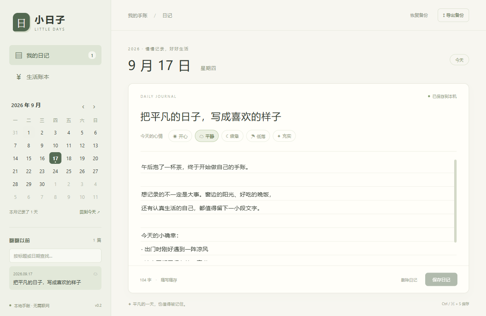
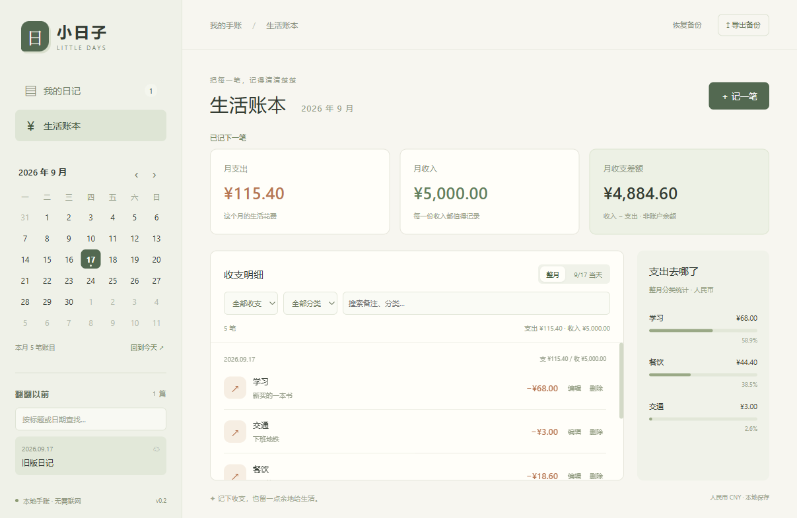

# Daily Croutons

小日子，一款离线使用的桌面手账。用 Vue 3、TypeScript 和 Electron 编写，日记保存在本机 SQLite 数据库中。



## 功能

- 按日期写日记，记录标题、正文和心情。
- 自动保存，支持 Ctrl / ⌘ + S；切换日期或正常关闭窗口前会等待保存完成。
- 日历浏览，按标题或日期查找历史记录。
- 导出 JSON 备份，恢复时合并记录，并自动保留恢复前的备份。
- 记录收入和支出，支持分类、备注、修改和删除，按日期、类型、分类筛选。
- 查看月收入、月支出、收支差额与支出分类占比。金额统一使用人民币。

v0.2.0 包含日记和记账，暂不支持图片附件和多设备同步。截图使用示例数据，首次打开时记录为空。



## 记账

从左侧进入「生活账本」，点击「记一笔」填写金额、日期、分类和备注。账目在点击「保存账目」后写入；日记仍然自动保存。Ctrl / ⌘ + S 可保存正在填写的账目。

日历用于切换月份和日期；明细可在整月和当天之间切换，并按收支类型、分类或备注查找。上方汇总和右侧分类统计始终对应整月，明细下方单独显示筛选结果合计。「月收支差额」为收入减支出，不代表账户余额。

金额最多两位小数，单笔范围 0.01～9,999,999.99 元。所有计算和存储使用整数分。

## 开发

需要 Node.js 24 LTS 和 pnpm。

```sh
git clone https://github.com/Oo10han/daily-croutons.git
cd daily-croutons
pnpm install
pnpm dev
```

首次安装会下载 Electron 运行时。通过 Electron 启动应用，单独打开网页无法访问本地数据库。

| 命令 | 用途 |
| --- | --- |
| `pnpm typecheck` | 检查 Vue 和 TypeScript 类型 |
| `pnpm test` | 运行数据库测试 |
| `pnpm build` | 检查类型并构建 |
| `pnpm test:e2e` | 构建后运行桌面端测试 |
| `pnpm test:dev` | 构建后测试开发服务器与数据库读写 |
| `pnpm start` | 启动构建结果 |
| `pnpm pack:win` | 生成 Windows 应用目录 |
| `pnpm dist:win` | 生成 Windows x64 安装包 |
| `pnpm dist:mac` | 在 Mac 上生成 DMG |

构建文件在 `out/`，安装包在 `release/`。Windows 版本也可以直接运行 `release/win-unpacked/Little Days.exe`，需要保留整个 `win-unpacked` 目录。

当前在 Windows 上开发和测试。Mac 构建尚未验证；安装包未签名，暂不支持自动更新。

## 项目结构

```text
src/
  main/           窗口、IPC、SQLite 和备份
  preload/        提供给界面的业务接口
  renderer/src/   Vue 页面与样式
  shared/         数据类型与接口定义
tests/            数据库和桌面端测试
```

数据库读写在主进程执行，界面通过 preload 调用业务接口。渲染进程启用沙箱和上下文隔离，日记内容按纯文本处理。

`Ledger.vue` 负责记账界面，`shared/finance.ts` 处理金额和分类，`main/database.ts` 负责账目读写及数据库迁移。

构建依赖中的 `@electron/get` 固定为 4.0.3，以提供 electron-builder 所需的 CacheMode API；升级打包工具时需一并检查此覆盖配置。

## 数据与备份

默认数据库位置：

- Windows：`%APPDATA%\Little Days\journal.sqlite`
- macOS：`~/Library/Application Support/Little Days/journal.sqlite`

开发版与安装版使用同一数据目录。设置 `LITTLE_DAYS_DATA_DIR` 可指定其他目录，自动化测试使用独立临时目录。

新版启动时自动添加账目表，保留已有日记。备份 v2 同时包含日记和账目：相同日期的日记、相同编号的账目会被覆盖，其余记录保留；重复导入不会重复添加同一编号的账目。v1 日记备份仍可导入，不改变现有账目。新版备份需使用 v0.2.0 或更高版本恢复。

恢复前的备份存放在数据目录下的 `before-import-时间戳.json`，可通过应用再次导入。备份上限为 20 MB、10000 篇日记、100000 笔账目。

数据库使用 WAL，请优先通过应用导出备份，避免仅复制正在使用的数据库文件而遗漏最近写入。数据库和备份尚未加密。

自动保存延迟约 550 毫秒。正常关闭会等待保存，强制结束进程或断电可能丢失尚未提交的输入。
